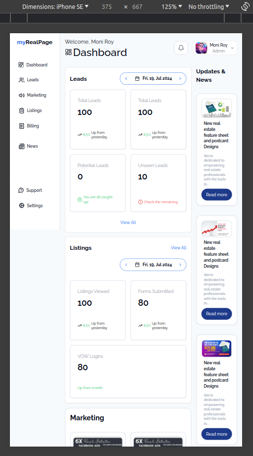

# myRealApp

## Version
0.1.0

## Introduction

Welcome to myRealApp! This frontend project leverages the power of React and the ShadCN component library to deliver a fully responsive and user-friendly interface for both desktop and mobile devices.

### Features

#### User Features
- **Responsive Design:** The application is optimized for both desktop and mobile devices, ensuring a seamless user experience across different screen sizes.
- **Login Page:** Secure login page for user authentication.
- **Dashboard:** Centralized view for essential user information and actions.

### Preview
#### Desktop

#### Mobile

### Frontend Technologies Used

- **Framework:** React
- **Component Library:** ShadCN
- **Styling:** Tailwind CSS

## Usage Disclaimer

This project and its associated images are used for educational and learning purposes. The application and any included images are not intended for commercial use.

## License

Copyright &copy; 2024 Pravinda. All Rights Reserved.  
This project is licensed under the [MIT License](LICENSE.txt).
